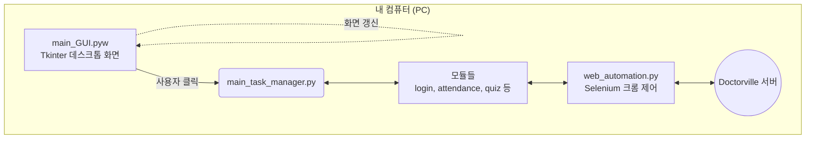
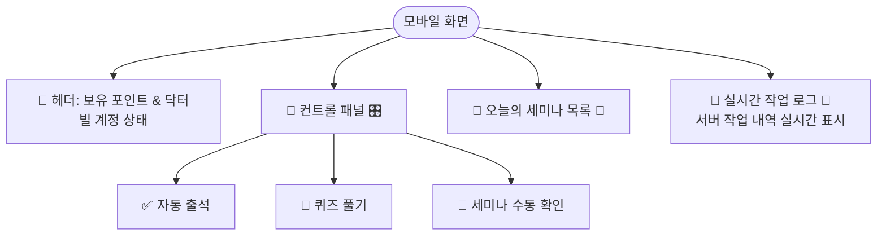

# 📱 DVA 모바일 웹 전환 계획서 (Migration Plan)

본 문서는 현재 **PC 데스크톱(Tkinter) 기반의 DVA 프로그램을 24시간 서버에서 가동 가능한 모바일 웹(FastAPI) 애플리케이션으로 전환**하기 위한 로드맵입니다.

기존에 잘 만들어진 핵심 로직(브라우저 제어, 포인트 수집 등)은 최대한 보존하고, 사용자 인터페이스(GUI)를 웹으로 교체하는 것이 핵심 목표입니다.

---

## 🏗️ 1. 아키텍처 변경 개요

현재 내 개인 PC에서만 돌아가던 데스크톱 프로그램을, 24시간 켜져있는 클라우드 서버에 올리고 스마트폰으로 원격 제어하는 구조로 변경합니다.

### 📉 AS-IS: 현재 아키텍처 (PC 로컬 환경)


### 📈 TO-BE: 전환 후 아키텍처 (클라우드 + 모바일 웹 환경)
```mermaid
graph TD
    subgraph "사용자 스마트폰/PC"
        UI[웹 브라우저<br/>HTML / CSS / JS 대시보드]
    end

    subgraph "클라우드 서버 (24시간 가동, Linux)"
        API[main_web.py<br/>FastAPI 서버]
        TM[main_task_manager.py<br/>기존 로직 재사용]
        MOD[모듈 및 봇 로직<br/>Selenium Headless 크롬]
        
        API <-->|API 호출 / 상태 반환| TM
        TM <--> MOD
    end

    UI <-->|1. 접속 및 명령 (HTTP/REST API)| API
    UI <..>|2. 실시간 상태 및 로그 스트리밍 (WebSocket)| API
    MOD <--> 닥터빌서버((Doctorville 서버))
    
    style UI fill:#e1f5fe,stroke:#03a9f4,stroke-width:2px
    style API fill:#e8f5e9,stroke:#4caf50,stroke-width:2px
    style TM fill:#fff3e0,stroke:#ff9800,stroke-width:2px
    style MOD fill:#f3e5f5,stroke:#9c27b0,stroke-width:2px
```

---

## 🛠️ 2. 단계별 구현 계획

### 1단계: 웹 서버 기반 구축 (Backend)
현재의 `main_GUI.pyw` 역할을 대체할 가벼운 웹 애플리케이션 서버를 만듭니다.

*   파이썬 최신 웹 프레임워크인 **FastAPI** 도입 (비동기 처리에 강하고 가벼워 적합)
*   `main_web.py` 생성: 모바일에서 버튼을 누를 때마다(ex. 로그인, 출석, 퀴즈) `/api/attendance`, `/api/quiz` 같은 API 엔드포인트 구현.
*   **의존성 분리**: `main_task_manager.py` 등 기존 모듈에서 직접적으로 `tkinter`의 컴포넌트나 변수를 참조하는 부분을 모두 제거하고, 결과를 JSON 형태나 이벤트 형식으로 반환하도록 수정합니다.

### 2단계: 모바일 친화적 웹 UI 개발 (Frontend)
복잡한 데스크톱 UI를 버리고, 한 손으로 조작하기 편한 모바일 대시보드를 만듭니다.



*   `templates/index.html` 생성 (HTML5 + 모바일 CSS 프레임워크 적용, 예: Bootstrap/Tailwind)
*   `static/app.js` 생성 (버튼 클릭 시 `FastAPI`로 HTTP 요청 전송 및 로딩 상태/응답 표시)
*   **실시간 로그 뷰어**: 백그라운드 서버에서 무슨 작업이 진행 중인지 실시간(WebSocket)으로 확인할 수 있는 터미널 모양 텍스트 상자.

### 3단계: 환경설정 최적화 및 로깅 (Integration)
서버 환경(Headless 모니터 없는 상태)에 맞게 프로그램 설정을 고정합니다.

*   `settings.json` 설정에서 `browser_headless`를 항시 `true`로 사용하도록 강제.
*   에러 발생 시 프로그램이 멈추지 않고 서버 로그에 기록되거나, **카카오톡 알림** 등이 가도록 에러 처리 방식 변경.
*   백그라운드 스케줄러를 사용하여 세미나 자동 감지/참여 로직을 서버 백그라운드 데몬으로 계속 구동.

### 4단계: 24/7 가동을 위한 서버 배포 (Deployment)
내 컴퓨터를 꺼도 1년 365일 돌아갈 수 있는 환경으로 이사합니다.

*   **클라우드 서버 대여**: **오라클 클라우드(Oracle Cloud Always Free)** 배포. (평생 무료)
*   리눅스(Ubuntu) 환경에 Python, 웹 서버, Headless Chrome 설치 스크립트 작성.
*   외부에서도 스마트폰 브라우저로 접속 가능하게 도메인 및 HTTPS 보안(SSL) 포트 연결 구조 구성.

---

## 🎯 3. 예상 소요 시간 및 난이도 정리

1.  **FastAPI 연동 및 백엔드 분리 작업**: 쉬움 ~ 중간
2.  **모바일 웹 UI (HTML/JS) 개발**: 중간
3.  **오라클 무료 서버 세팅 및 배포**: 어려움 (리눅스 CLI 환경과 포트 설정, 크롬 드라이버 권한 세팅 등 필요)

## 📌 4. 다음 행동 제안

계획서가 마음에 드신다면, 가장 밑단 작업인 **"1단계: FastAPI 기초 구조 API (`main_web.py`) 만들기"**부터 시작해 볼까요?
기존에 `tkinter`로 강하게 연결된 부분을 조금 풀어주는 작업부터 진입하게 됩니다.
